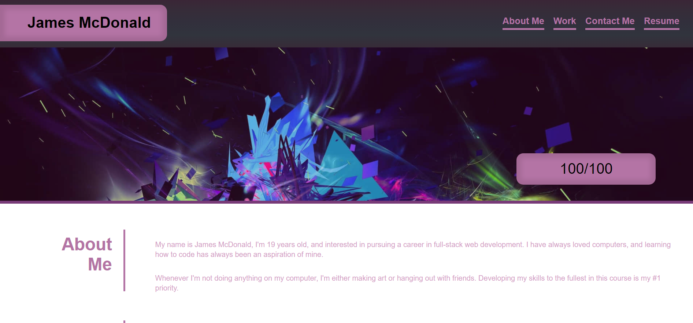
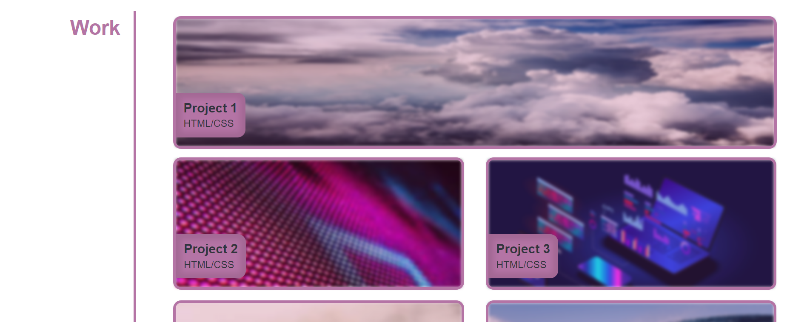
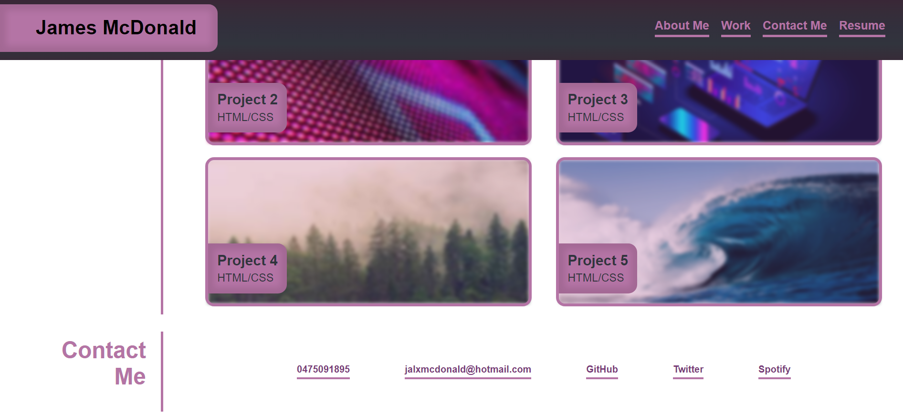
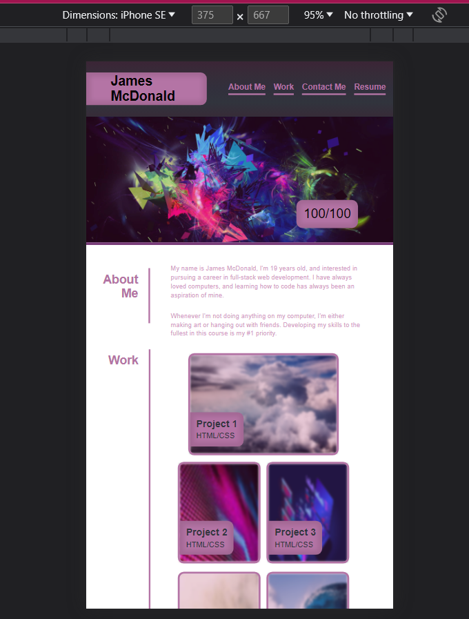

# <Your-Project-Title>

## Description

As an aspiring web developer, my goal is to establish a successful career by showcasing my work and skills in a way that doesn't require my physical presence. To achieve this, I have created a portfolio website that serves as a platform to inform users about myself and my projects.

I began development by constructing a basic structure using HTML and then developed its appearance with CSS. By implementing accessible navigation, a coherent design, and functional transitions with hover effects, I have ensured an engaging, user-friendly experience. Additionally, I have made sure that the website is responsive to smaller viewports.

## Installation

N/A

## Usage

Upon visiting the website, users see a navigation banner and a hero image. The navigation allows users to access different content by clicking on the respective links. Each link takes the user to a specific element where they can read and further inquire about myself. Users can also scroll past the hero image to view content themselves.

The first section, "About Me," is an introduction, offering two concise paragraphs that provide insight into my background and my aspirations.

In the second section, "Work," users can explore my portfolio (currently empty). The section features interactive elements where users can hover over five tabs, each revealing unique hover effects. Clicking on any of these tabs will redirect users to the corresponding project.

The third section, "Contacts," displays a list of contact options, providing users with various ways to get in touch with me. Clicking on any of the contact options will directly lead users to the respective contact platform.

## Credits

N/A

## License

Refer to the LICENSE in the repo (MIT).

## Features

Ease of access, through unique and stark graphic design.
Accessible hyperlinks.
Functional.
Has name, hero photo, and links to the certain elements in page that function as intended.
UI scrolls to corresponding section when clicked on by nav.
First work application larger than others.
Clicking on work application will send user to app.
Adapts to user's viewport with responsive layout.

## Images

